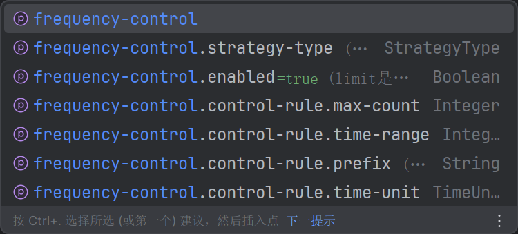

# frequency-spring-boot-starter
## 1. 项目结构:

```
├─src
│  ├─main
│  │  ├─java
│  │  │  └─com
│  │  │      └─zhang
│  │  │          │  FrequencyControlAutoConfiguration.java  ##自动装配类
│  │  │          │  
│  │  │          ├─config
│  │  │          │      RedisConfig.java
│  │  │          │      
│  │  │          ├─core
│  │  │          │  │  ControlProperties.java    ##核心配置类，可以在配置中自定义限流规则
│  │  │          │  │  ControlRule.java          ##限流规则整理
│  │  │          │  │  
│  │  │          │  ├─aspect
│  │  │          │  │      ControlAspect.java    ##注解切入处理
│  │  │          │  │      FrequencyControl.java ##自定义限流注解
│  │  │          │  │      
│  │  │          │  └─strategy
│  │  │          │      │  AbstractStrategy.java ##抽象类实现限流策略
│  │  │          │      │  ControlManager.java   ##限流策略管理接口
│  │  │          │      │  StrategyType.java     ##枚举限流策略类型
│  │  │          │      │  
│  │  │          │      └─impl
│  │  │          │              LeakyBucketStrategy.java  ##漏桶限流策略实现
│  │  │          │              SlideWindowStrategy.java  ##滑动窗口限流策略实现
│  │  │          │              
│  │  │          ├─exception
│  │  │          │      ControlException.java    ##限流全局异常
│  │  │          │      
│  │  │          └─utils
│  │  │                  RedisUtil.java
│  │  │                  WebUtil.java
│  │  │                  
│  │  └─resources
│  │      │  application-aliyun.yml
│  │      │  application-local.yml
│  │      │  application.yml
│  │      │  
│  │      ├─lua
│  │      │      leakyBucketStrategy.lua         ##漏桶限流策略的lua脚本
│  │      │      slideWindowStrategy.lua         ##滑动窗口限流策略的lua脚本
│  │      │      
│  │      └─META-INF
│  │              spring.factories
```

## 2.核心配置使用


## 3.项目实现
1. 使用注解+Aop实现对接口的限流

2. 限流策略实现滑动窗口和漏桶限流：

   1. 使用@ConditionalOnProperty实现加载要使用的Bean：

   ```Go
      @ConditionalOnProperty(prefix = "frequency-control", name = "strategy-type", havingValue = "slide_window")
      ```

   2. 通过抽象类实现两种种限流规则，可以由核心配置设置：

   ```Go
      frequency-control:
        strategy-type: leaky_bucket
      ```

3. 实现限流规则可以由核心配置设置，注解的规定大于配置

4. 使用lua脚本保证redis的频率计数的原子性：

   1. lua的语法就是简单了解了一下call函数，实现了查询增加删除


